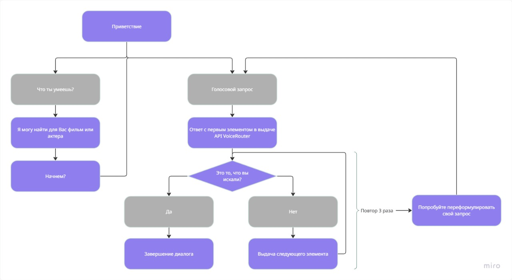

# Ассистент

<ol>
    <li>Распознавание речи</li>
    <li>Понимание намерения пользователя и отправка соответствующего запроса в систему
    </li>
    <li>Работа с сервисами кинотеатра, в частности, с сервисом поиска фильмов
    </li>
    <li>Админ-панель с возможностью редактирования навыков ассистента
    </li>
</ol>

# Реализация

Для принятия решения о том, что хочет узнать пользователь используется ElasticSearch, он по ключевым фразам подбирает наиболее подходящий endpoint из Async API.

Затем интеграция с нейросетью Groq помогает заполнить из человеческого текста пользователя параметры для выбранного запроса.

Далее запрос отправляется в Async API и затем ответ вложенный в человеческую форму передается пользователю 

Алгоритм работы Алисы (или любго другого голосовой или текстового помощника)

